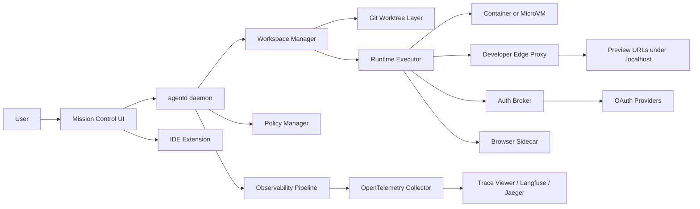
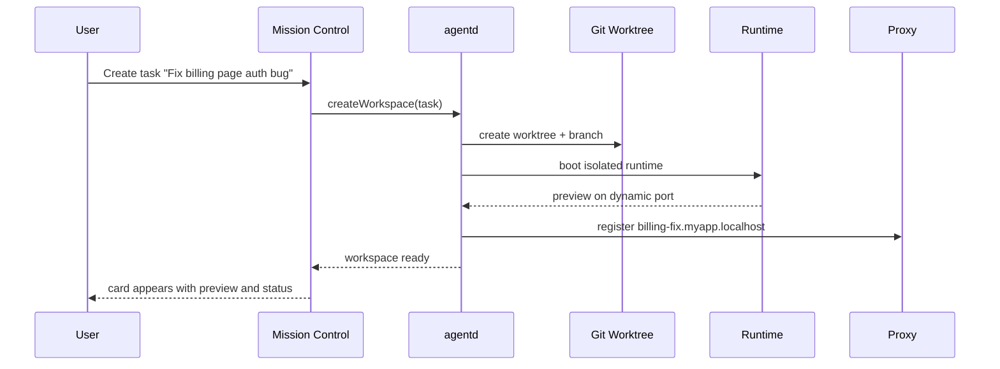
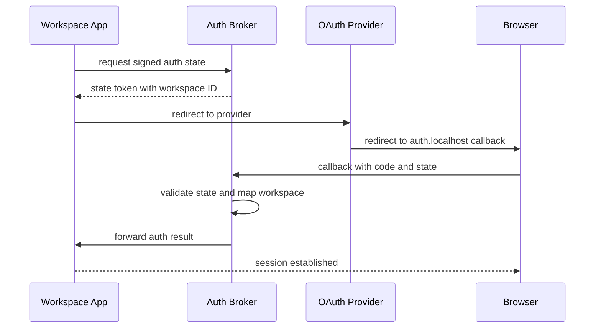
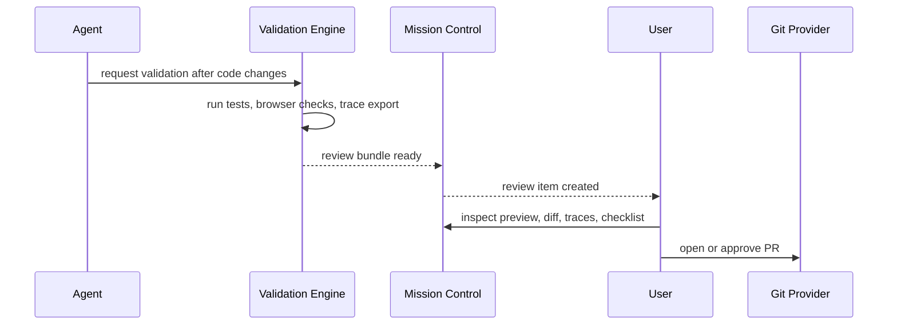

# TakomiDX Agent Workspace Platform Spec

## Overview

TakomiDX is a local-first agent orchestration platform for multi-agent coding workflows. It exists to solve the mismatch between modern coding agents and the current desktop environment.

The core product thesis is:

> Multi-agent coding is not a terminal problem. It is a local platform problem.

Today's operating systems treat development as a single-user, single-focus workflow. Agentic coding breaks that assumption. Multiple agents need stable identity, isolated runtime state, stable preview routing, traceability, and a control plane that lets a human supervise work without getting lost in tabs, ports, or PR noise.

TakomiDX turns a developer machine into a structured, multi-tenant local platform with the following guarantees:

- Every agent gets a durable workspace.
- Every workspace gets stable identity.
- Every preview gets a human-readable hostname.
- Every auth flow gets a stable callback surface.
- Every run gets a trace, cost record, and replayable event log.
- Every code change must be validated through a runnable review loop, not dumped as an opaque PR.

This document defines how the product should work end to end, including system architecture, DX patterns, implementation guidance, data model, and phased rollout.

## Product Goals

### Primary goals

- Run many coding agents in parallel without terminal chaos.
- Eliminate manual port management.
- Make auth flows reliable in local multi-workspace development.
- Give users one place to see what each agent is doing.
- Make agent decisions observable and debuggable.
- Replace low-trust PR dumping with high-trust local validation and review bundles.
- Preserve local developer control while allowing cloud or remote execution later.

### Secondary goals

- Make workspaces resumable after machine restarts.
- Support both solo developers and small teams.
- Support local, containerized, and remote execution backends under one model.
- Provide an upgrade path from MVP to a full agent-native desktop environment.

### Non-goals

- Replacing GitHub, GitLab, or existing git hosting.
- Building a full general-purpose operating system in v1.
- Replacing existing editors in v1.
- Solving every possible auth provider edge case on day one.
- Providing a full cloud-hosted IDE in the MVP.

## Core Product Thesis

TakomiDX should be designed around the concept of a **workspace capsule**.

A workspace capsule is the main unit of execution and supervision. It bundles:

- a git worktree or checkout
- an isolated runtime
- one or more agent sessions
- preview URLs
- auth session routing
- logs
- traces
- browser automation state
- review artifacts

The user should never need to think first about:

- terminal tabs
- random ports
- which browser tab belongs to which agent
- where logs live
- why OAuth broke on port 3001

The user should think first about:

- which task is running
- whether it is healthy
- what changed
- how to validate it
- whether to approve, steer, or stop it

## Design Principles

### 1. Workspaces before processes

The product should model tasks as durable workspaces, not ephemeral shell commands.

### 2. Stable identity everywhere

Every workspace should have a stable name, hostname, trace ID prefix, and notification identity.

### 3. Isolation by default

Agents should not share mutable runtime state unless explicitly configured to do so.

### 4. Human-readable routing

Users should open `billing-fix.myapp.localhost`, not `localhost:3017`.

### 5. Verification over generation

The goal is not to maximize lines of code produced. The goal is to maximize trusted, validated progress.

### 6. Observability is a product feature

Tracing, cost visibility, and replay are not internal plumbing. They are core DX.

### 7. Incremental adoption

The architecture should allow a user to start with local worktrees and containers, then later adopt richer components like microVMs, IDE integrations, and remote execution.

## Key User Personas

### Solo power user

Runs 2-8 agents locally while coding in an existing editor. Needs speed, low friction, and clear control.

### Staff engineer / tech lead

Oversees multiple parallel tasks, reviews results, and cares deeply about traceability, review quality, and risk.

### Small team

Uses agents for feature work, migrations, tests, and cleanup. Needs consistent workflow and shareable artifacts.

### Platform builder

Wants policy controls, spend limits, security boundaries, and reproducible environments.

## The Mental Model

TakomiDX should feel like a local mission control system for autonomous workers.

Each workspace is a card, not a terminal tab.

Each card owns:

- task name
- repo and branch
- assigned agent
- status
- preview
- logs
- traces
- review checklist

The user should be able to answer the following at any time in under 5 seconds:

- What is running?
- What is blocked?
- What already finished?
- Which workspace triggered the notification?
- What URL should I open?
- What changed?
- Why did it stop?
- How much did it cost?

## High-Level Architecture



## Main System Components

### 1. `agentd` daemon

`agentd` is the local control-plane daemon. It is the authoritative source of truth for active workspaces and agent runs.

### Responsibilities

- Create and destroy workspaces.
- Allocate stable workspace identity.
- Launch agents.
- Coordinate runtime isolation.
- Register previews with the developer edge proxy.
- Register auth routes with the auth broker.
- Stream status events to the UI.
- Enforce budgets and policies.
- Persist session state.
- Expose a local API for Mission Control and IDE extensions.

### Suggested implementation

- Language: Go or Rust.
- Local API: HTTP + WebSocket or SSE.
- Storage: SQLite for durable local metadata.
- Process supervision: internal supervisor with restart policy.

### Core local API examples

```json
{
  "workspaceId": "ws_01HZX8Y7B7",
  "slug": "billing-fix",
  "repoPath": "C:\\Projects\\myapp",
  "branch": "agent/billing-fix",
  "runtimeType": "container",
  "previewHost": "billing-fix.myapp.localhost",
  "status": "running"
}
```

```json
{
  "runId": "run_01HZX8YJQ5",
  "workspaceId": "ws_01HZX8Y7B7",
  "agentType": "claude-code",
  "status": "awaiting_human",
  "lastTool": "npm test",
  "tokenCostUsd": 2.41,
  "stopReason": null
}
```

### 2. Workspace Manager

The Workspace Manager creates the durable task capsule.

### Responsibilities

- Create a git worktree for the task.
- Attach runtime config.
- Create metadata record.
- Restore previous workspace state on restart.
- Clean up after completion or archival.

### Suggested workspace layout

```text
takomi/
  workspaces/
    ws_01HZX8Y7B7/
      meta.json
      runtime.env
      review/
      traces/
      logs/
      browser/
```

### Git strategy

- Base repo remains untouched.
- Each workspace uses `git worktree`.
- Branch naming convention:
  - `agent/<task-slug>`
  - `review/<task-slug>`

### Why worktrees matter

This allows the user to open, inspect, and run agent output locally without switching away from their main branch.

### 3. Runtime Executor

The Runtime Executor runs the workspace in an isolated environment.

### Supported modes

- Local process mode
- Container mode
- MicroVM mode
- Remote mode

### Recommended default

For MVP on Windows and cross-platform development:

- use git worktrees on the host
- use containers for runtime isolation
- optionally use WSL2-backed Docker where needed

### Responsibilities

- boot runtime
- inject environment variables
- mount workspace
- start dev server
- expose preview metadata
- run agent process
- report health

### Container mode implementation

- Base image per stack or devcontainer spec
- Mount worktree into container
- Shared cache volumes for package managers
- Dedicated network per workspace

### MicroVM mode implementation

MicroVM mode is the later-stage answer for stronger isolation and durable "agent desktops".

- Firecracker-backed or equivalent microVM runtime
- Per-workspace lightweight VM
- Faster boot than traditional VM
- Better boundary for risky tool usage

### 4. Developer Edge Proxy

This component solves the localhost problem by providing stable, human-readable preview identity.

### Responsibilities

- route stable hostnames to dynamic internal ports
- optionally terminate local TLS
- expose preview health
- maintain routing table

### Example routing scheme

- `billing-fix.myapp.localhost`
- `test-migration.myapp.localhost`
- `auth.localhost`

### Why `.localhost`

`.localhost` is appropriate for local loopback naming and removes the need for users to memorize ports.

### Suggested implementation

- Caddy or Traefik
- Dynamic configuration generated by `agentd`
- One stable host port: 80 or 443 locally

### Example route record

```json
{
  "workspaceId": "ws_01HZX8Y7B7",
  "host": "billing-fix.myapp.localhost",
  "target": "127.0.0.1:45231",
  "tls": true,
  "healthPath": "/"
}
```

### 5. Auth Broker

The Auth Broker decouples app identity from runtime port assignment.

### Responsibilities

- receive all local OAuth callbacks on a stable address
- identify the target workspace
- forward or finalize auth state
- persist session mapping

### Core rule

User-facing auth callbacks should never depend on random workspace ports.

### Example callback scheme

- `https://auth.localhost/callback/github/<workspace-id>`
- `https://auth.localhost/callback/google/<workspace-id>`

### Routing model

1. Workspace initiates auth request.
2. Broker signs state containing workspace identity.
3. Provider redirects to stable broker callback.
4. Broker validates state.
5. Broker forwards session result to the correct workspace.

### Alternative flow for agent tool auth

For CLI-like agent identity where browser redirects are unnecessary:

- use OAuth device flow
- or use PAT / service account / development credentials

### Security notes

- sign and validate callback state
- bind state to workspace and nonce
- expire callback sessions quickly
- never expose raw tokens in general logs

### 6. Browser Sidecar

Agents that touch UI cannot remain blind.

The Browser Sidecar is a Playwright or CDP-backed companion service for each workspace.

### Responsibilities

- open the workspace preview
- capture screenshots
- read DOM state
- collect browser console errors
- collect network errors
- execute scripted validation steps

### Why this matters

Without browser context, an agent can change code that looks correct in source but fails visually or at runtime.

### Example sidecar outputs

- screenshot set
- console log summary
- failed request list
- DOM selector existence checks
- accessibility audit summary

### 7. Observability Pipeline

Observability is a first-class feature.

### Required events

- prompt issued
- model selected
- tool call started
- tool call completed
- token count
- cost
- stop reason
- human intervention
- filesystem diff generated
- preview health failure
- browser console error

### Recommended tracing model

- OpenTelemetry for canonical event structure
- Langfuse, Jaeger, or equivalent viewer for analysis
- local append-only event journal for replay

### Event categories

| Category | Examples |
|----------|----------|
| Agent reasoning | prompt, response, plan update |
| Tool execution | shell command, file edit, browser action |
| Runtime health | server booted, server crashed, port registered |
| Review | preview opened, checklist item passed, human approved |
| Cost | tokens, model spend, budget warnings |

### Sample event

```json
{
  "timestamp": "2026-03-07T12:00:00Z",
  "workspaceId": "ws_01HZX8Y7B7",
  "runId": "run_01HZX8YJQ5",
  "type": "tool.completed",
  "tool": "shell",
  "name": "npm test",
  "durationMs": 4312,
  "exitCode": 1,
  "summary": "2 tests failed"
}
```

### 8. Policy Manager

Agents are non-deterministic. Policy must be part of the runtime, not an afterthought.

### Responsibilities

- token spend caps
- time limits
- concurrency limits
- filesystem restrictions
- dangerous command approval gates
- auto-pause loops

### Example policies

- Max 5 concurrent active workspaces
- Max $10 per run unless user approves extension
- Require approval for `rm -rf`, database resets, and credential changes
- Auto-pause after 3 repeated identical failing tool calls

### 9. Mission Control UI

Mission Control is the central product surface. It should be the place the user opens first and keeps open.

### Core views

- Workspace Grid
- Workspace Detail
- Review Queue
- Trace Explorer
- Settings / Policies

### Workspace Grid contents

Each card should show:

- workspace name
- repo name
- agent type
- current status
- elapsed time
- last action
- preview link
- token cost
- health signal

### Status states

- queued
- booting
- running
- awaiting_human
- validating
- failed
- completed
- archived

### Suggested card layout

```text
+------------------------------------------------------+
| billing-fix                              RUNNING     |
| repo: myapp  branch: agent/billing-fix               |
| agent: Claude Code                                   |
| last action: running Playwright smoke test           |
| preview: billing-fix.myapp.localhost                 |
| cost: $2.41   elapsed: 18m   trace health: healthy   |
| [Open Preview] [Open Code] [Open Logs] [Pause]       |
+------------------------------------------------------+
```

### Workspace Detail view

This page should have tabs:

- Summary
- Activity
- Logs
- Trace
- Preview
- Diff
- Validation
- Settings

### 10. IDE Extension

The IDE extension should not replace Mission Control. It should make workspace context available where code review and steering already happen.

### Main extension features

- show active workspace in a side panel
- open preview for current workspace
- show trace link
- show pending approvals
- compare agent changes against current branch
- attach inline comments or steering notes back to the run

### Primary editors to target

- VS Code first
- Cursor and Windsurf later if supported
- JetBrains only after the model stabilizes

## End-to-End User Flows

### Flow 1: Create a workspace and start an agent



### DX example

The user clicks `New Workspace`.

The modal asks for:

- task title
- repo
- base branch
- runtime type
- agent type
- validation mode

The system returns immediately with a new card in `booting` state. Within seconds the card resolves to `running`, with an `Open Preview` button already wired to the stable hostname.

### Flow 2: OAuth login inside a workspace



### DX example

The workspace card shows a pill:

- `Auth required`

Clicking it opens a guided action drawer:

- Provider: GitHub
- Callback target: `auth.localhost`
- Workspace: `billing-fix`
- State: `ready`

If the callback succeeds, the card updates:

- `Auth healthy`

If it fails, the card shows:

- `Auth failed: redirect mismatch`

The user can click `Inspect` and see the exact callback route and provider error.

### Flow 3: Agent runs, hits an issue, and requests help

### DX example

The card status changes from `running` to `awaiting_human`.

The system notification should say:

`billing-fix is waiting for approval to reset test database`

Not:

`Task complete`

The notification click should deep-link into the exact workspace detail and open the `Approvals` drawer.

The drawer should show:

- requested action
- why the agent wants it
- affected resources
- risk level
- approve once / always allow / deny

### Flow 4: Review and validate agent output



### Review bundle contents

- preview URL
- test summary
- browser console summary
- changed files
- trace link
- cost summary
- risk hotspots
- suggested validation checklist

### Core product rule

A workspace should not be considered complete merely because the agent stopped.

A workspace is complete when:

- validation is green or explicitly waived
- human review is recorded
- output is accepted, archived, or sent back for another iteration

## Detailed DX Specification

### Workspace Grid

### Purpose

Provide constant top-level awareness across all active workspaces.

### Sorting and grouping

- group by status by default
- sort running workspaces by recent activity
- pin current or high-priority workspaces
- filter by repo, agent type, or tag

### Color semantics

- neutral gray: queued / archived
- blue: booting / validating
- green: healthy running or completed validation
- amber: awaiting human or budget warning
- red: failed or unhealthy

### Inline quick actions

- open preview
- open editor
- open logs
- pause
- resume
- archive

### Workspace Detail

### Summary tab

Shows the key facts first:

- what the task is
- what changed
- current status
- next required action

### Activity tab

An event feed with semantic entries, not raw terminal dump.

Example feed:

- `12:02 PM` Agent created branch `agent/billing-fix`
- `12:03 PM` Dev server booted at `billing-fix.myapp.localhost`
- `12:04 PM` Browser sidecar detected 2 console errors
- `12:06 PM` Agent patched `src/auth/callback.ts`
- `12:08 PM` OAuth callback succeeded
- `12:10 PM` Validation bundle created

### Logs tab

Raw terminal output for debugging, but secondary to the activity feed.

### Trace tab

A structured trace view with:

- step tree
- duration
- cost per span
- stop reasons
- repeated failure clusters

### Diff tab

A repo-aware diff with agent summaries on each file cluster.

### Validation tab

Contains:

- checklist
- screenshots
- preview launch
- console errors
- test runs
- final approval state

### Notifications

Notifications must always answer:

- which workspace
- what happened
- what action is needed

### Good notification examples

- `checkout-redesign finished validation. Preview is ready.`
- `billing-fix needs approval for database reset.`
- `test-migration exceeded its $10 budget and is paused.`
- `auth-refactor failed to boot preview. Click to inspect runtime logs.`

### Bad notification examples

- `Task finished`
- `An agent needs input`
- `Server error`

### Error Handling DX

### Preview boot failure

If the dev server fails to boot:

- card turns red
- status becomes `failed`
- primary CTA becomes `Inspect Runtime`
- detail page opens to logs + environment summary

### Proxy registration failure

If proxy registration fails:

- show both intended hostname and internal port
- allow manual fallback open
- provide copyable diagnostics

### Auth callback mismatch

If provider rejects callback:

- surface provider error text
- show expected callback URL
- show registered workspace callback route
- suggest resolution path

### Infinite loop detection

If the same failing tool call repeats several times:

- auto-pause run
- banner: `Likely loop detected`
- show repeated command cluster
- offer `resume once`, `edit instruction`, or `terminate`

## Data Model

### Workspace

| Field | Type | Description |
|-------|------|-------------|
| id | string | durable workspace ID |
| slug | string | human-readable identifier |
| repoPath | string | source repo root |
| branch | string | branch tied to workspace |
| runtimeType | enum | local, container, microvm, remote |
| previewHost | string | stable hostname |
| status | enum | lifecycle status |
| createdAt | datetime | creation timestamp |
| archivedAt | datetime nullable | archival time |

### Agent Run

| Field | Type | Description |
|-------|------|-------------|
| id | string | run ID |
| workspaceId | string | parent workspace |
| agentType | string | provider / agent flavor |
| status | enum | run status |
| startedAt | datetime | start time |
| endedAt | datetime nullable | end time |
| tokenCostUsd | number | accumulated spend |
| stopReason | string nullable | terminal cause |

### Preview Route

| Field | Type | Description |
|-------|------|-------------|
| workspaceId | string | owning workspace |
| host | string | stable hostname |
| target | string | runtime target |
| tls | boolean | local TLS enabled |
| healthStatus | enum | healthy or unhealthy |

### Auth Session

| Field | Type | Description |
|-------|------|-------------|
| id | string | auth session ID |
| workspaceId | string | owning workspace |
| provider | string | github, google, etc |
| stateNonce | string | signed state nonce |
| status | enum | requested, callback_received, failed, completed |
| expiresAt | datetime | expiry |

### Validation Bundle

| Field | Type | Description |
|-------|------|-------------|
| id | string | validation bundle ID |
| workspaceId | string | owning workspace |
| previewUrl | string | validation target |
| testSummary | json | test results |
| screenshotSet | json | screenshots |
| consoleSummary | json | browser diagnostics |
| traceRef | string | trace ID or URL |
| reviewerDisposition | string nullable | approved, rejected, needs work |

## Implementation Plan

### Phase 1: MVP

### Goal

Solve the main local DX failures with minimal platform invention.

### Scope

- `agentd` daemon
- workspace manager using git worktrees
- container runtime executor
- developer edge proxy with `.localhost` routing
- Mission Control workspace grid
- basic logs and event feed
- browser sidecar for simple validation
- manual review bundle generation

### Suggested stack

- Go or Rust daemon
- SQLite metadata store
- Docker runtime
- Caddy reverse proxy
- React or Tauri Mission Control UI
- Playwright sidecar

### Success criteria

- user can run 3-5 workspaces in parallel
- each workspace has a stable hostname
- no manual port picking
- user can identify a notification source instantly
- user can inspect diffs and preview from one place

### Phase 2: Reliability and Observability

### Scope

- OpenTelemetry instrumentation
- trace explorer integration
- budget controls and loop detection
- auth broker
- validation checklists
- richer review bundles
- VS Code extension

### Success criteria

- each run has trace and cost visibility
- auth succeeds through stable broker routes
- repeated failure loops auto-pause
- review artifacts are generated consistently

### Phase 3: Agent-Native Desktop

### Scope

- microVM runtime option
- richer policy engine
- resumable workspace desktop state
- side-by-side embedded editor and preview
- replayable run journal
- remote workspace mode

### Success criteria

- stronger isolation for risky or long-lived workspaces
- durable workspace restoration after reboot
- replayable postmortem for failures
- cloud-backed workspaces under same abstraction

## Security Model

### Principles

- least privilege by default
- isolate runtime from host wherever possible
- do not expose secrets to general logs
- gate dangerous commands
- separate human and agent credentials when possible

### Recommended practices

- use environment scoping per workspace
- use short-lived auth broker state
- redact tokens from trace exports
- restrict write scope to workspace path
- record all approval actions

## Performance Considerations

### Likely bottlenecks

- container boot latency
- package install duplication
- browser sidecar overhead
- trace volume growth

### Mitigations

- shared dependency caches
- warm base images
- optional sidecar modes
- log retention policy
- archive old traces and screenshots

## Open Questions

- Should Mission Control be desktop-first with Tauri, or web-first with a small tray daemon?
- Should workspace previews default to HTTP or local HTTPS from day one?
- How much of the auth broker belongs in the product versus project templates?
- Should validation run continuously or only on explicit checkpoints?
- What is the right abstraction for editor integration across non-VS Code surfaces?

## Product Summary

TakomiDX should not be built as "yet another agent terminal".

It should be built as a local developer platform with:

- workspace capsules
- stable hostnames
- auth routing
- observability
- browser-aware validation
- human-centered review loops

If implemented well, the user experience changes from:

- too many terminals
- lost ports
- broken auth
- black-box runs
- ignored PR dumps

to:

- one control plane
- one stable workspace model
- one reviewable validation loop
- many agents operating safely in parallel

That is the product.
