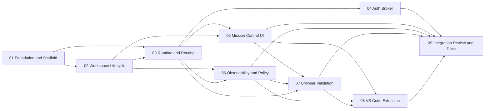

# TakomiDX Orchestrator Master Plan

**Session:** `orch-20260307-030731`  
**Mode:** `takomi / mode-orchestrator`  
**Source Spec:** `docs/features/TakomiDX_Agent_Workspace_Platform_Spec.md`

## Objective

Turn the TakomiDX platform spec into an execution-ready build plan with clean task boundaries, explicit dependencies, and zero filler.

## Current State

- Research is complete.
- Product/platform specification exists.
- `src/` is effectively empty.
- No application scaffold, daemon, runtime layer, or UI exists yet.

This is greenfield implementation planning.

## Scope Guardrails

- MVP is local-first.
- MVP is web-first for Mission Control.
- MVP runtime isolation uses containers, not microVMs.
- MVP editor integration targets VS Code only.
- MVP supports one active human user on one machine.
- Remote execution, microVM desktops, JetBrains support, and multi-user collaboration are post-MVP.

## Skills Registry

| Skill | Path | Why It Matters |
|------|------|----------------|
| `takomi` | `C:/Users/johno/.agents/skills/takomi/SKILL.md` | Primary orchestration protocol |
| `spawn-task` | `C:/Users/johno/.agents/skills/spawn-task/SKILL.md` | Self-contained execution prompts |
| `avoid-feature-creep` | `C:/Users/johno/.agents/skills/avoid-feature-creep/SKILL.md` | MVP discipline |
| `monorepo-management` | `C:/Users/johno/.agents/skills/monorepo-management/SKILL.md` | Clean repo and package boundaries |
| `nextjs-standards` | `C:/Users/johno/.agents/skills/nextjs-standards/SKILL.md` | Mission Control web app standards |
| `frontend-design` | `C:/Users/johno/.agents/skills/frontend-design/SKILL.md` | Control-plane DX quality |
| `webapp-testing` | `C:/Users/johno/.agents/skills/webapp-testing/SKILL.md` | Browser verification and DX validation |
| `code-review` | `C:/Users/johno/.agents/skills/code-review/SKILL.md` | Final quality gate |
| `sync-docs` | `C:/Users/johno/.agents/skills/sync-docs/SKILL.md` | Documentation alignment |

## Workflows Registry

| Workflow | Path | Use |
|---------|------|-----|
| `mode-orchestrator` | `C:/Users/johno/.agents/skills/takomi/workflows/mode-orchestrator.md` | Session coordination |
| `vibe-primeAgent` | `C:/Users/johno/.agents/skills/takomi/workflows/vibe-primeAgent.md` | Context priming for every task |
| `mode-architect` | `C:/Users/johno/.agents/skills/takomi/workflows/mode-architect.md` | Architecture and boundary-setting |
| `vibe-design` | `C:/Users/johno/.agents/skills/takomi/workflows/vibe-design.md` | DX/system design execution |
| `vibe-build` | `C:/Users/johno/.agents/skills/takomi/workflows/vibe-build.md` | Implementation tasks |
| `review_code` | `C:/Users/johno/.agents/skills/takomi/workflows/review_code.md` | Final review and stabilization |
| `vibe-syncDocs` | `C:/Users/johno/.agents/skills/takomi/workflows/vibe-syncDocs.md` | Final doc sync |
| `vibe-spawnTask` | `C:/Users/johno/.agents/skills/takomi/workflows/vibe-spawnTask.md` | Task authoring reference |

## Task Table

| # | Subtask | Mode | Workflow | Skills | Depends On | Parallel Group |
|---|---------|------|----------|--------|------------|----------------|
| 01 | Foundation and repo scaffold | architect/code | `mode-architect` | `takomi`, `spawn-task`, `avoid-feature-creep`, `monorepo-management`, `nextjs-standards` | none | Wave 1 |
| 02 | Workspace lifecycle and persistence | code | `vibe-build` | `takomi`, `avoid-feature-creep` | 01 | Wave 2 |
| 03 | Runtime executor and developer edge routing | code | `vibe-build` | `takomi`, `avoid-feature-creep` | 01, 02 | Wave 3 |
| 04 | Auth broker and session routing | code | `vibe-build` | `takomi`, `avoid-feature-creep` | 03 | Wave 4A |
| 05 | Mission Control UI shell and workspace DX | design/code | `vibe-design` | `takomi`, `nextjs-standards`, `frontend-design`, `avoid-feature-creep` | 01, 02, 03 | Wave 4B |
| 06 | Observability and policy engine | code | `vibe-build` | `takomi`, `avoid-feature-creep` | 02, 03 | Wave 4C |
| 07 | Browser sidecar and validation bundles | code/test | `vibe-build` | `takomi`, `webapp-testing`, `avoid-feature-creep` | 03, 05, 06 | Wave 5A |
| 08 | VS Code extension and editor hooks | code | `vibe-build` | `takomi`, `nextjs-standards`, `avoid-feature-creep` | 05, 06, 07 | Wave 5B |
| 09 | Integration hardening, review, and doc sync | review | `review_code` | `takomi`, `code-review`, `sync-docs`, `webapp-testing` | 01-08 | Wave 6 |

## Dependency Graph

## Completion Criteria

- A user can create and run multiple workspaces from one control surface.
- Each workspace has stable preview identity.
- Agent activity is visible and attributable.
- Validation artifacts are generated before work is considered complete.
- Review surfaces exist for both browser and editor contexts.
- The build is documented well enough to support the next implementation wave.

## Progress Checklist

- [x] Task 01 complete
- [ ] Task 02 complete
- [x] Task 03 complete
- [ ] Task 04 complete
- [ ] Task 05 complete
- [ ] Task 06 complete
- [ ] Task 07 complete
- [ ] Task 08 complete
- [ ] Task 09 complete
