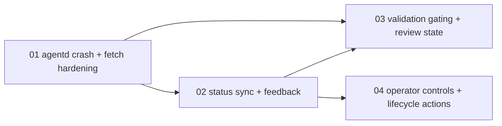

# TakomiDX QA Debug Session Master Plan

**Session:** `orch-20260307-232325-qa1`  
**Mode:** `takomi / mode-orchestrator`  
**Source Inputs:** manual runbook plus `docs/issues/First test.pdf`

## Objective

Turn the first manual operator findings into execution-ready debug tasks with clear reproduction context, dependencies, and success criteria.

## Evidence Sources

- [manual_test_runbook.md](C:/CreativeOS/01_Projects/Code/Personal_Stuff/2026-03-07_TakomiUX/docs/tasks/orchestrator-sessions/orch-20260307-030731/manual_test_runbook.md)
- [First test.pdf](C:/CreativeOS/01_Projects/Code/Personal_Stuff/2026-03-07_TakomiUX/docs/issues/First%20test.pdf)
- [First test_extracted.txt](C:/CreativeOS/01_Projects/Code/Personal_Stuff/2026-03-07_TakomiUX/docs/issues/First%20test_extracted.txt)
- [findings_summary.md](C:/CreativeOS/01_Projects/Code/Personal_Stuff/2026-03-07_TakomiUX/docs/tasks/orchestrator-sessions/orch-20260307-232325-qa1/findings_summary.md)

## Summary Of Findings

- Mission Control can leave stale success banners and duplicate booting pills after workspace creation and runtime start.
- Runtime status can lag real container state and appear to oscillate.
- Triggering runtime logs and health refresh appears capable of crashing `agentd` with an unhandled socket write error.
- Once `agentd` drops, Mission Control detail, activity, and diff views fail with `fetch failed`.
- Validation is callable before runtime readiness and then leaves sticky failed state and misleading actions behind.
- Validation and review bundle presentation are inconsistent across healthy and unhealthy workspaces.
- Stop/archive/delete controls are missing or unclear from the operator surface.

## Skills Registry

| Skill | Path | Why It Matters |
|------|------|----------------|
| `takomi` | `C:/Users/johno/.agents/skills/takomi/SKILL.md` | Primary orchestration protocol |
| `spawn-task` | `C:/Users/johno/.agents/skills/spawn-task/SKILL.md` | Self-contained bug-fix task authoring |
| `webapp-testing` | `C:/Users/johno/.agents/skills/webapp-testing/SKILL.md` | Browser reproduction and verification |
| `nextjs-standards` | `C:/Users/johno/.agents/skills/nextjs-standards/SKILL.md` | Mission Control App Router correctness |
| `code-review` | `C:/Users/johno/.agents/skills/code-review/SKILL.md` | Final stabilization pass for risky changes |

## Workflows Registry

| Workflow | Path | Use |
|---------|------|-----|
| `mode-orchestrator` | `C:/Users/johno/.agents/skills/takomi/workflows/mode-orchestrator.md` | Session coordination |
| `vibe-spawnTask` | `C:/Users/johno/.agents/skills/takomi/workflows/vibe-spawnTask.md` | Debug task authoring |
| `vibe-build` | `C:/Users/johno/.agents/skills/takomi/workflows/vibe-build.md` | Implementation tasks |
| `review_code` | `C:/Users/johno/.agents/skills/takomi/workflows/review_code.md` | Post-fix review and stabilization |

## Task Table

| # | Subtask | Mode | Workflow | Skills | Depends On | Priority |
|---|---------|------|----------|--------|------------|----------|
| 01 | Agentd runtime polling crash and Mission Control fetch-failure hardening | code | `vibe-build` | `takomi`, `spawn-task`, `webapp-testing`, `nextjs-standards` | none | P0 |
| 02 | Workspace status synchronization and operator feedback cleanup | code/design | `vibe-build` | `takomi`, `spawn-task`, `webapp-testing`, `nextjs-standards` | 01 | P1 |
| 03 | Validation gating, retry behavior, and review bundle state consistency | code | `vibe-build` | `takomi`, `spawn-task`, `webapp-testing`, `nextjs-standards` | 01, 02 | P1 |
| 04 | Operator controls for runtime stop, archive, delete, and restart semantics | code/design | `vibe-build` | `takomi`, `spawn-task`, `nextjs-standards` | 02 | P1 |

## Dependency Graph

## Completion Criteria

- `agentd` no longer crashes during normal runtime polling or log streaming.
- Mission Control degrades gracefully when `agentd` is unavailable instead of exploding into `fetch failed` pages.
- Runtime state, banners, and pills reflect real status transitions without duplication or stale errors.
- Validation cannot be launched in invalid runtime states and successful reruns clear stale failure UI.
- Operators can discover and use runtime stop plus workspace archive/delete flows safely.

## Progress Checklist

- [x] Findings ingested from the first PDF test pass
- [x] Debug task session created
- [x] Task 01 complete
- [x] Task 02 complete
- [x] Task 03 complete
- [x] Task 04 complete
