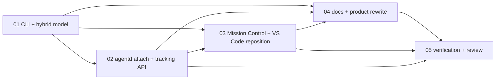

# TakomiDX CLI-First Pivot Session Master Plan

**Session:** `orch-20260308-cli-pivot-01`  
**Mode:** `takomi / mode-orchestrator`  
**Source Inputs:** approved pivot plan, current platform docs, current `agentd` / Mission Control / VS Code companion implementation

## Objective

Turn the approved CLI-first pivot into execution-ready agent tasks that preserve the current control-plane foundation while changing the primary user entrypoint from Mission Control to terminal-native workflows.

## Evidence Sources

- [README.md](C:/CreativeOS/01_Projects/Code/Personal_Stuff/2026-03-07_TakomiUX/README.md)
- [Project_Requirements.md](C:/CreativeOS/01_Projects/Code/Personal_Stuff/2026-03-07_TakomiUX/docs/Project_Requirements.md)
- [TakomiDX_Agent_Workspace_Platform_Spec.md](C:/CreativeOS/01_Projects/Code/Personal_Stuff/2026-03-07_TakomiUX/docs/features/TakomiDX_Agent_Workspace_Platform_Spec.md)
- [VSCode_Companion.md](C:/CreativeOS/01_Projects/Code/Personal_Stuff/2026-03-07_TakomiUX/docs/features/VSCode_Companion.md)
- [packages/contracts/src/index.ts](C:/CreativeOS/01_Projects/Code/Personal_Stuff/2026-03-07_TakomiUX/packages/contracts/src/index.ts)
- [services/agentd/src/server.ts](C:/CreativeOS/01_Projects/Code/Personal_Stuff/2026-03-07_TakomiUX/services/agentd/src/server.ts)

## Summary Of Direction

- Preserve `agentd`, shared contracts, preview routing, auth broker, validation bundles, and observability as the platform foundation.
- Pivot the product thesis from "Mission Control is the primary surface" to "Takomi meets developers in the terminal, IDE, and agent app they already use."
- Make terminal + Codex-compatible tracking the first milestone.
- Treat Mission Control and the VS Code companion as secondary review and observability surfaces.
- Defer any new Takomi-native chat shell until the CLI and attach model is validated.

## Skills Registry

| Skill | Path | Why It Matters |
|------|------|----------------|
| `takomi` | `C:/Users/johno/.agents/skills/takomi/SKILL.md` | Primary orchestration protocol |
| `spawn-task` | `C:/Users/johno/.agents/skills/spawn-task/SKILL.md` | Self-contained execution tasks |
| `nextjs-standards` | `C:/Users/johno/.agents/skills/nextjs-standards/SKILL.md` | Keep Mission Control and App Router changes disciplined |
| `subagent-driven-development` | `C:/Users/johno/.agents/skills/subagent-driven-development/SKILL.md` | Useful for splitting the implementation into clean reviewed sub-work |
| `code-review` | `C:/Users/johno/.agents/skills/code-review/SKILL.md` | Final review gate on risky cross-surface changes |

## Workflows Registry

| Workflow | Path | Use |
|---------|------|-----|
| `mode-orchestrator` | `C:/Users/johno/.agents/skills/takomi/workflows/mode-orchestrator.md` | Session coordination |
| `vibe-build` | `C:/Users/johno/.agents/skills/takomi/workflows/vibe-build.md` | Implementation tasks |
| `vibe-primeAgent` | `C:/Users/johno/.agents/skills/takomi/workflows/vibe-primeAgent.md` | Mandatory context loading at task start |
| `review_code` | `C:/Users/johno/.agents/skills/takomi/workflows/review_code.md` | Final review and stabilization |

## Task Table

| # | Subtask | Mode | Workflow | Skills | Depends On | Priority |
|---|---------|------|----------|--------|------------|----------|
| 01 | CLI package and hybrid attached-vs-managed run model | code/architect | `vibe-build` | `takomi`, `spawn-task`, `nextjs-standards` | none | P0 |
| 02 | `agentd` attach, process tracking, and non-container preview registration API | code | `vibe-build` | `takomi`, `nextjs-standards` | 01 | P0 |
| 03 | Mission Control and VS Code reposition around attached and managed workspaces | code | `vibe-build` | `takomi`, `nextjs-standards` | 01, 02 | P1 |
| 04 | Product docs and platform framing rewrite for the CLI-first thesis | architect/docs | `vibe-build` | `takomi`, `spawn-task` | 01, 02, 03 | P1 |
| 05 | Verification, regression review, and rollout notes | review | `review_code` | `takomi`, `code-review` | 01, 02, 03, 04 | P1 |

## Dependency Graph

## Completion Criteria

- A `takomi` CLI entrypoint is specified and implemented for `run`, `attach`, `status`, `open`, and `logs`.
- `agentd` can create or reuse attached workspaces and track external local processes or agent sessions without requiring Takomi-managed worktrees.
- Preview routing works for both managed runtime targets and attached local process targets.
- Mission Control and the VS Code companion present attached and managed workspaces as peer concepts while clearly distinguishing owned vs external runs.
- Product documentation consistently describes Takomi as a CLI-first local control plane with secondary web and editor surfaces.
- Managed workspace flows remain backward compatible.

## Progress Checklist

- [x] Session scaffold created
- [x] Task 01 complete
- [ ] Task 02 complete
- [ ] Task 03 complete
- [ ] Task 04 complete
- [ ] Task 05 complete
